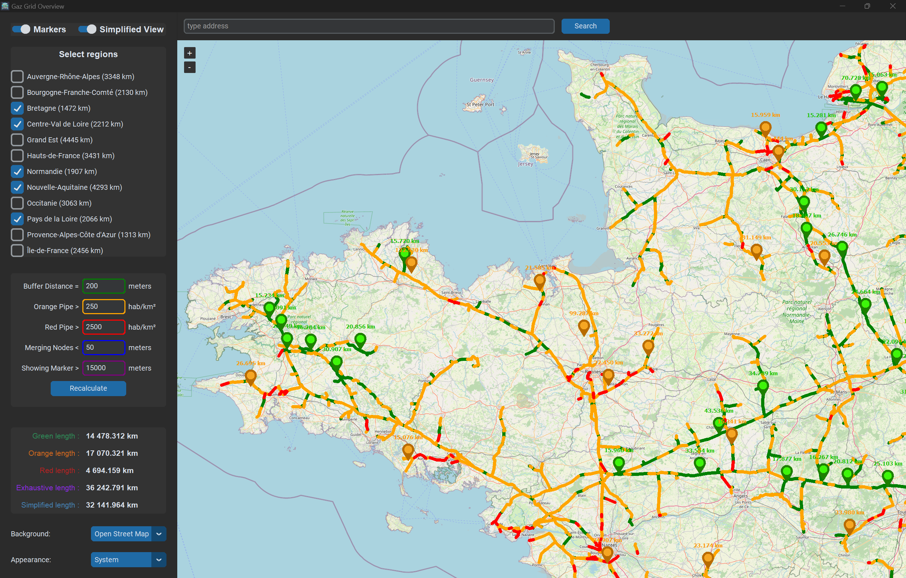

<div align="center">
  <h1>GazGridOverview</h1>
  
</div>

GazGridOverview is a project aimed at providing an interactive interface for viewing the flyable sections of the gas network in metropolitan France. This project is designed to offer a clear and intuitive visualization of gas infrastructures, thereby facilitating aerial network monitoring.

The core of this project is the intersection between population data from INSEE (gridded data at 200m from the 2019 study "Income, poverty, and living standards") and data from the two gas distribution networks: GRTgaz and Teréga.

<div align="center">
    
    
    
</div>

# Installation

## Clone the repository and install dependencies

```bash
git clone https://github.com/rognit/GazGridOverview.git
cd GazGridOverview
pip install -r requirements.txt
```

## Download and prepare the data:

Download the data in CSV format from the following sources:
- [INSEE](https://www.insee.fr/fr/statistiques/7655475?sommaire=7655515)
- [GRTgaz](https://www.data.gouv.fr/fr/datasets/trace-simplifie-du-reseau-grtgaz-precis-a-environ-250-m/)
- [Teréga](https://www.data.gouv.fr/fr/datasets/trace-simplifie-du-reseau-terega-precis-a-environ-250-m/)

The files must retain their original names:
- `carreaux_200m_met_2019.csv`
- `trace-du-reseau-grt-250.csv`
- `terega-trace-du-reseau.csv`

and be placed in the `resources/raw/` folder.

## Pre-process the data

Run the following scripts to filter the data and create the base resource files:

```bash
python setup.py
```
This will create the following required files in the `resources/` folder:
- `base_gaz_network.csv`
- `base_population.csv`
- `simplified_computed_gaz_network.csv`
- `exhaustive_computed_gaz_network.csv`
- `information.csv`
- `green_markers.csv`
- `orange_markers.csv`

## Run the project:

```bash
python main.py
```

## Build version:

```bash
pyinstaller --onefile --icon='resources/icon.ico' --add-data 'resources/icon.ico:resources' --add-data 'resources/base_gaz_network.csv:resources' --add-data 'resources/base_population.csv:resources' --add-data 'resources/simplified_computed_gaz_network.csv:resources' --add-data 'resources/exhaustive_computed_gaz_network.csv:resources' --add-data 'resources/information.csv:resources' --add-data 'resources/green_markers.csv:resources' --add-data 'resources/orange_markers.csv:resources' --name GazGridOverview main.py
```
The build file will then be located in the `dist/` folder.


# Features

## Base feature

### Interactive visualization of the French metropolitan gaz network
- Ability to toggle regions on/off (local data).
- Population density above each segment (segment overflight difficulty) with three color levels:
  - **Green**: less than 250 inhabitants/km² (no overflight restriction)
  - **Orange**: between 250 and 2500 inhabitants/km² (authorization required)
  - **Red**: more than 2500 inhabitants/km² (overflight impossible)

See [Segment Color Calculation](doc/segment_color_calculation.md) for more details.

## Simplified network toggle

- **Exhaustive View**: Visualisation of the classic French gaz network (base view)
- **Simplified View**: Visualization of a simpler version of the network, made by merging nearby nodes

See [Simplified Network Calculation](doc/simplified_network_calculation.md) for more details.

## Marker toggle

A marker highlights a related sub-part of the network, connected, of maximum size, which complies with one of the following rules:
- **Green Marker**: pure green subnetwork (no overflight restriction)
- **Orange Marker**: subnetwork segments are either green or orange (overflight permission partially required)

When a marker is clicked, the key information about the subnetwork are displayed in the console:
- Exhaustive Green Length (Orange marker only)
- Exhaustive Orange Length (Orange marker only)
- Exhaustive Total Length
- Simplified Total Length

## Other Features

4 supported **map backgrounds** (API call):
- **OpenStreetMap**
- **Classic Google Maps**
- **Google Maps satellite**
- **OACI map**

**Compute panel** with different parameters:
- To recalculate each **segment color** (exhaustive network therefore simplified network too):
    - **Buffer Distance**: The buffer distance on either side of each segment (default 200m)
    - **Orange Pipe Threshold**: The population density at which a green segment becomes orange (default 250 inhabitants/km²)
    - **Red Pipe Threshold**: The population density at which an orange segment becomes red (default 2500 inhabitants/km²)
- To recalculate the **merging nodes** (simplified network):
    - **Merging Node Threshold**: Diameter of node merge cluster (default 50m)
- To control **marker display**:
    - **Marker Showing Threshold**: Minimum length of marker segment group to display the marker. It's more a display parameter than a calculation parameter (default 5 km)

**Information panel** with global statistics for the entire network based on current parameters:
- **Green Network Length**: Sum of the lengths of the green segments of the exhaustive network
- **Orange Network Length**: Sum of the lengths of the orange segments of the exhaustive network
- **Red Network Length**: Sum of the lengths of the red segments of the exhaustive network
- **Exhaustive Network Length**: Total length of the exhaustive network (No matter the color)
- **Simplified Network Length**: Total length of the simplified network (No matter the color)

**Theme switch** between light and dark mode

**Search bar** to find a specific location

**Right-click** on the map to get the coordinates
