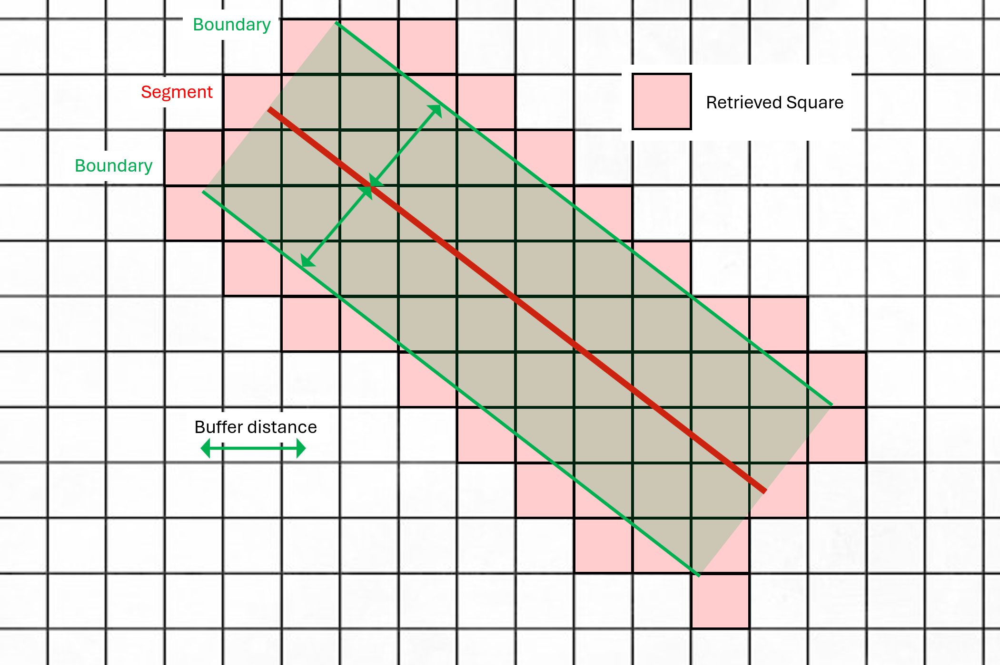

# GazGridOverview
<div style="text-align: center;">
    
</div>

GazGridOverview is a project aimed at providing an interactive interface for viewing the flyable sections of the gas network in metropolitan France. This project is designed to offer a clear and intuitive visualization of gas infrastructures, thereby facilitating aerial network monitoring.

The core of this project is the intersection between population data from INSEE (gridded data at 200m from the 2019 study "Income, poverty, and living standards") and data from the two gas distribution networks: GRTgaz and Teréga.

<div style="text-align: center;">
    
    
</div>

## Features

### Network

- **Base View**: Visualisation of the French gaz network (exhaustive view)
- **Simplified View**: Visualization of a simpler version of the network (by merging nearby nodes)

### Marker

- **Displaying of**:
    - **Green Marker**: Display of green segments
    - **Orange Marker**: Display of orange segments


### Other Features

- **Four supported map backgrounds**: (API call)
    - OpenStreetMap
    - Classic Google Maps
    - Google Maps satellite
    - OACI map

- **Interactive visualization** of the French metropolitan gas network with the ability to toggle regions on/off (local data).

- **Detailed information on each segment**:
    - Population density above the network (segment overflight difficulty) with three color levels:
        - **Green**: less than 250 inhabitants/km² (no overflight restriction)
        - **Orange**: between 250 and 2500 inhabitants/km² (authorization required)
        - **Red**: more than 2500 inhabitants/km² (overflight impossible)
- **Ability to recalculate segment colors** with different parameters:
    - **Buffer Distance**: The buffer distance on either side of each segment (default 200m)
    - **Orange Pipe Threshold**: The population density at which a green segment becomes orange (default 250 inhabitants/km²)
    - **Red Pipe Threshold**: The population density at which an orange segment becomes red (default 2500 inhabitants/km²)
    - **Merging Node Threshold**: Diameter of node merge cluster (default 50m)
    - **Marker Showing Threshold**: Minimum length of marker segment group to display the marker. It's more a display parameter than a calculation parameter (default 5 km)
- **Markers**:
    - **Green**: for green segments
    - **Orange**: for orange segments
- **Network visualization**:
    
    
- **Ability to display markers**:
    - **Green**: for green segments
    - **Orange**: for orange segments


## Installation

### Clone the repository and install dependencies

```bash
git clone https://github.com/rognit/GazGridOverview.git
cd GazGridOverview
pip install -r requirements.txt
```

### Download and prepare the data:
Download the data in CSV format

- [INSEE](https://www.insee.fr/fr/statistiques/7655475?sommaire=7655515)
- [GRTgaz](https://www.data.gouv.fr/fr/datasets/trace-simplifie-du-reseau-grtgaz-precis-a-environ-250-m/)
- [Teréga](https://www.data.gouv.fr/fr/datasets/trace-simplifie-du-reseau-terega-precis-a-environ-250-m/)

The files must retain their original names:
- `carreaux_200m_met_2019.csv`
- `trace-du-reseau-grt-250.csv`
- `terega-trace-du-reseau.csv`

and be placed in the `resources/raw/` folder.

A slight manual data cleaning is required (some regions may be missing from certain segments, and there are also duplicates that need to be removed).

### Pre-process the data
Run the following scripts to filter the data and create the base resource files:

```bash
python setup.py
```

This will create the files `resources/gaz_network.csv` and `resources/pop_filtered.csv`.

Then run the `data/calculator.py` file for an initial calculation of segment colors:

```bash
python data/calculator.py
```

### Run the project:

```bash
python main.py
```

### Build version:

```bash
pyinstaller --onefile --icon='resources/icon.ico' --add-data 'resources/icon.ico:resources' --add-data 'resources/base_gaz_network.csv:resources' --add-data 'resources/base_population.csv:resources' --add-data 'resources/simplified_computed_gaz_network.csv:resources' --add-data 'resources/exhaustive_computed_gaz_network.csv:resources' --add-data 'resources/information.csv:resources' --add-data 'resources/green_markers.csv:resources' --add-data 'resources/orange_markers.csv:resources' --name GazGridOverview main.py
```

The build file will then be located in the `dist/` folder.

## Algorithm Details

For each segment:
- **For the edge**:

  <div style="text-align: center;">
    
  </div>

- **For the two vertices**:

  <div style="text-align: center;">
    
  </div>

All squares with at least one point within `buffer_distance` of the segment are considered in the color calculation. The segment color is determined by the highest population density among all retrieved squares.


clic droit: on a les coordonnées