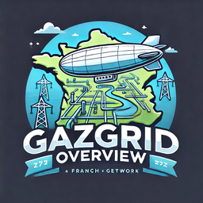
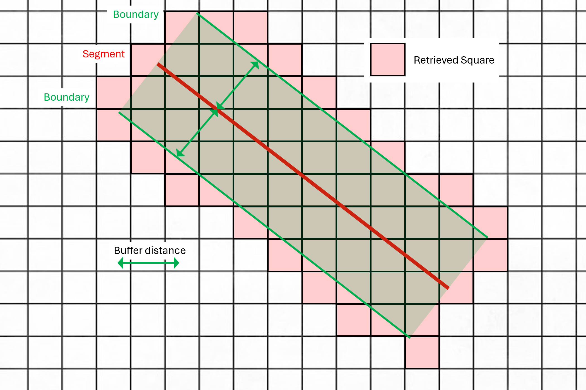
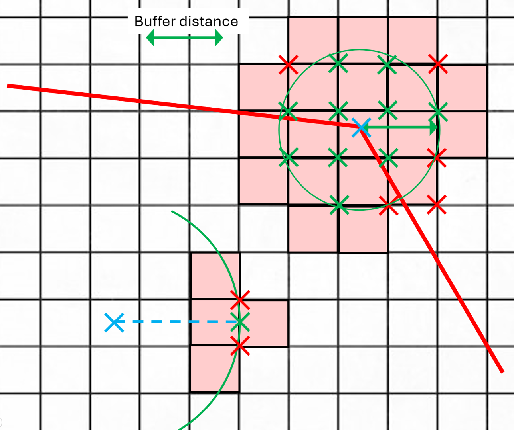

# GazGridOverview
<div style="text-align: center;">
    
</div>

GazGridOverview est un projet visant à fournir une interface interactive permettant le visionnage des tronçons survolables du réseau de gaz de la France métropolitaine. Ce projet est conçu pour offrir une visualisation claire et intuitive des infrastructures de gaz, facilitant ainsi la surveillance du réseau par voie aérienne. Le cœur de ce projet est le croisement entre les données de population de l’INSEE (données carroyées à 200m de l’étude « Revenus, pauvreté et niveau de vie » de 2019) et les données des deux réseaux de distribution de gaz : GRTgaz et Teréga.

<div style="text-align: center;">
    
    
</div>

## Fonctionnalités

- **Visualisation interactive** du réseau de gaz métropolitain avec la possibilité de cocher/décocher les régions à afficher/cacher (données locales).
- **Trois fonds de carte pris en charge** :
  - OpenStreetMap
  - Google Maps classique
  - Google Maps satellite
- **Informations détaillées sur chaque segment** :
  - Densité de population au-dessus du réseau (difficulté de survol du segment) avec trois niveaux de couleurs :
    - **Vert** : moins de 250 hab/km² (aucune restriction de survol)
    - **Orange** : entre 250 et 2500 hab/km² (demande d’autorisation nécessaire)
    - **Rouge** : plus de 2500 hab/km² (survol impossible)
- **Possibilité de recalcul des couleurs des segments** avec différents paramètres :
  - **Buffer distance** : La distance tampon de part et d’autre de chaque tronçon (par défaut 200m)
  - **Orange Threshold** : La densité de population à partir de laquelle un tronçon vert devient orange (par défaut 250 hab/km²)
  - **Red Threshold** : La densité de population à partir de laquelle un tronçon orange devient rouge (par défaut 2500 hab/km²)

## Précisions sur l’algorithme

Pour chaque segment :
- **Pour l’arête** :

  <div style="text-align: center;">
    
  </div>

- **Pour les deux sommets** :

  <div style="text-align: center;">
    
  </div>

Tous les carrés dont au moins un point a une distance inférieure à `buffer_distance` avec le segment sont pris en compte dans le calcul de sa couleur. La couleur du segment est déterminée par la plus haute densité de population parmi l’ensemble des carrés récupérés.

## Installation

### Clonez le dépôt et installez les dépendances

```bash
git clone https://github.com/rognit/GazGridOverview.git
cd GazGridOverview
pip install -r requirements.txt
```

### Téléchargez et préparez les données:
Téléchargez les données au format CSV

- [INSEE](https://www.insee.fr/fr/statistiques/7655475?sommaire=7655515)
- [GRTgaz](https://www.data.gouv.fr/fr/datasets/trace-simplifie-du-reseau-grtgaz-precis-a-environ-250-m/)
- [Teréga](https://www.data.gouv.fr/fr/datasets/trace-simplifie-du-reseau-terega-precis-a-environ-250-m/)

Les fichiers doivent conserver leurs noms d’origine :
- `carreaux_200m_met_2019.csv`
- `trace-du-reseau-grt-250.csv`
- `terega-trace-du-reseau.csv`

et être placés dans le dossier `resources/raw/`.

Un léger travail de nettoyage manuel des données doit être effectué (il manque parfois des régions à certains tronçons, il y a aussi des duplicatas qu’il faut supprimer).

### Pré-traitez les données
Exécutez les scripts suivants pour filtrer les données et créer les fichiers ressources de base :


```bash
python data/gaz_network_filter.py
python data/insee_filter.py
```

Cela créera les fichiers `resources/gaz_network.csv` et `resources/pop_filtered.csv`.

Exécutez ensuite le fichier `data/calculator.py` pour un calcul initial des couleurs des tronçons :

```bash
python data/calculator.py
```

### Exécuter le projet :

```bash
python main.py
```

### Version build :

```bash
pyinstaller --onefile --windowed --add-data 'resources/gaz_network.csv:resources' --add-data 'resources/gaz_network_colored.csv:resources' --add-data 'resources/gaz_network_colored_merged.csv:resources' --add-data 'resources/pop_filtered.csv:resources' --name GazGridOverview main.py
```

Le fichier build se trouvera alors dans le dossier `dist/`.