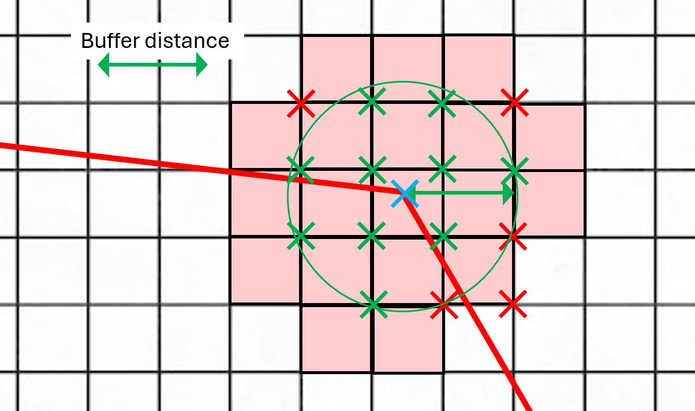

# algorithm-details

## Segment Color Calculation

### Introduction

The segment color is determined by the worst population density among all the squares that are within `buffer_distance` of the segment.
The color is then determined by comparing this density to the thresholds:
- Green: less than 250 inhabitants/km²
- Orange: between 250 and 2500 inhabitants/km²
- Red: more than 2500 inhabitants/km²

**The challenging aspect of the algorithm lies in accurately correlating the pipeline segments with the population grid.**

This issue can be broken down into two simpler sub-problems:
- correlating along the segment (**edge**)
- correlating at the two endpoints (**vertices**)

Both of these squares retrieving sub-problems must be addressed while considering the `buffer distance` parameter.

### Edge Correlation

Before retrieving all the squares that are within `buffer_distance` of the segment, we need to simply be able to retrieve all the squares that intersect any segment.
This is achieved with exact precision and relatively low complexity by using the following strategy:
1. From the points (X1, Y1) and (X2, Y2), retrieve the associated affine function f such that f(X1) = Y1 and f(X2) = Y2.
2. Apply f to all integers Xi between X1 and X2 to obtain the list of Yi.
3. All the squares on either side of each point (Xi, Yi) are crossed by our segment. $ x_i $ \( x_i \)

For each segment:
- **For the edge**:
  

    
  

- **For the two vertices**:

  

    
  

All squares with at least one point within `buffer_distance` of the segment are considered in the color calculation. The segment color is determined by the highest population density among all retrieved squares.
