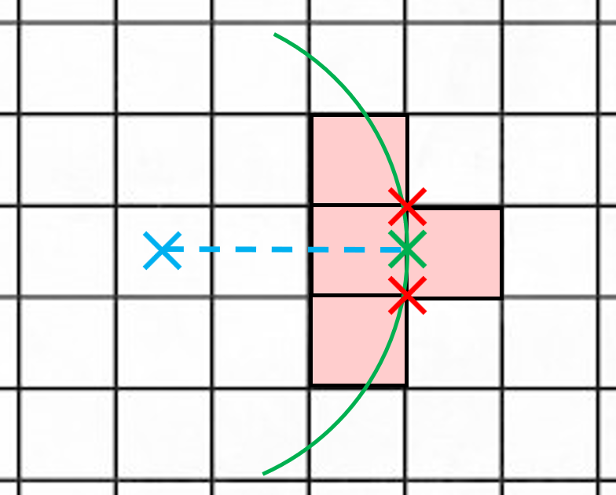

# Segment Color Calculation

## Introduction

The segment color is determined by the worst population density among all the squares that are within `buffer_distance` of the segment.
The color is then determined by comparing this density to the thresholds:
- Green: less than 250 inhabitants/km²
- Orange: between 250 and 2500 inhabitants/km²
- Red: more than 2500 inhabitants/km²

**The challenging aspect of the algorithm lies in accurately correlating the pipeline segments with the population grid.**

This issue can be broken down into two simpler sub-problems:
- correlating along the segment (**edge**)
- correlating at the two endpoints (**vertices**)

Both of these squares retrieving sub-problems must be addressed while considering the `buffer distance` parameter.

## Edge Correlation

### Line Correlation

Before retrieving all the squares that are within `buffer_distance` of the segment, we need to simply be able to retrieve all the squares that intersect any segment.
This is achieved with exact precision and relatively low complexity by using the following strategy:
1. From the points (X1, Y1) and (X2, Y2), retrieve the associated affine function f such that f(X1) = Y1 and f(X2) = Y2.
2. Apply f to all integers Xi between X1 and X2 to obtain the list of Yi.
3. All the squares on either side of each point (Xi, Yi) are crossed by our segment, and are therefore retrieved
4. All intermediate vertical tiles between Yi and Yi+1 are also retrieved.

  

### Buffer Correlation

Once we have the squares crossed by the segment, we need to retrieve all squares within the `buffer_distance` of the segment.
This can also be done with precision and low complexity by following this approach:

1. Compute the boundaries of the buffer (two parallel segments on either side of the original segment at a distance of `buffer_distance`).
2. Add intermediate parallel segments between these boundaries, spaced by `square_size`.
3. Use the previous algorithm to retrieve all squares crossed by the two boundaries or any of the intermediate segments.

Before retrieving all the squares within the `buffer_distance` of a segment, we first need to be able to retrieve all the squares that intersect any given segment. This can be done with precision and relatively low complexity using the following approach:

  

### Final result for the edge

With these two algorithms, we can precisely recover all squares within the `buffer_distance` of the segment.

  

## Vertex Correlation

Now that we understand how to retrieve all the squares within a certain `buffer_distance` from one edge, we need to apply a similar method for the 2 vertices.

Our goal is to identify all the squares that have any part within a specified `buffer_distance` from a point P.

To achieve this, we'll use an approach based on concentric square rings: 
As long as we can successfully retrieve squares from one ring, we'll continue by moving outward to the next ring.

  

To recover the squares in each ring, we'll examine all the intersections along the outer edge.
If an intersection is within the `buffer_distance` from point P, then all four squares connected at that intersection will have portions within the `buffer_distance` of point P.

  

However, this algorithm isn't entirely foolproof.
Some squares may have portions within the `buffer_distance` of point P, even though none of their corners lie within that range.
This situation typically occurs for squares at the 2 boundaries of the row and column containing point P.

To handle these cases, we need to check an additional four squares at the ends of the row and column of point P.

  

In the example above, we can clearly see that part of the rightmost square is inside the `buffer_distance` radius circle,
even though none of its corners is inside the circle.
