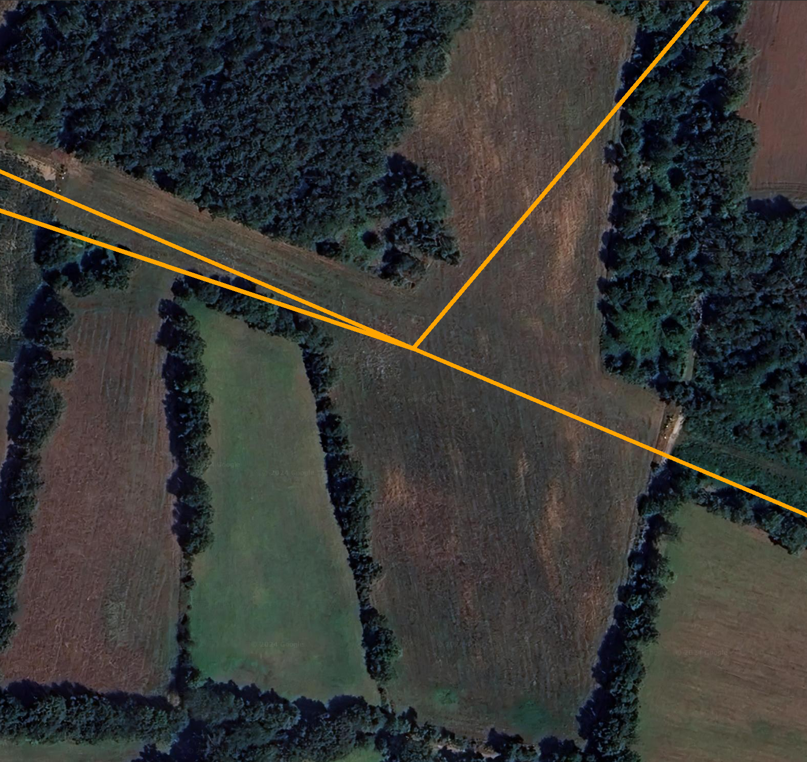
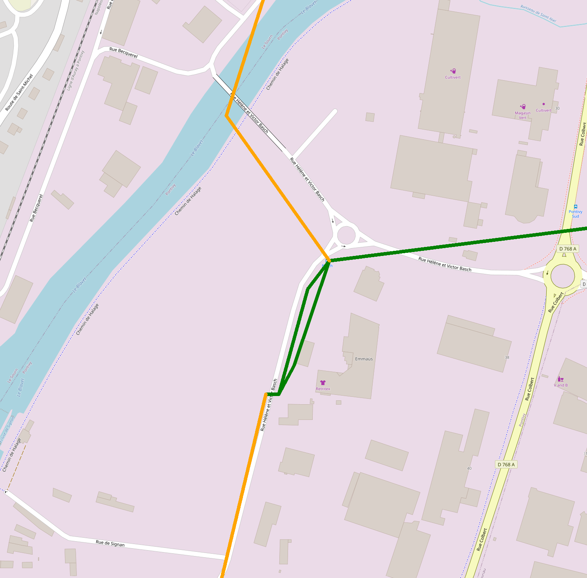
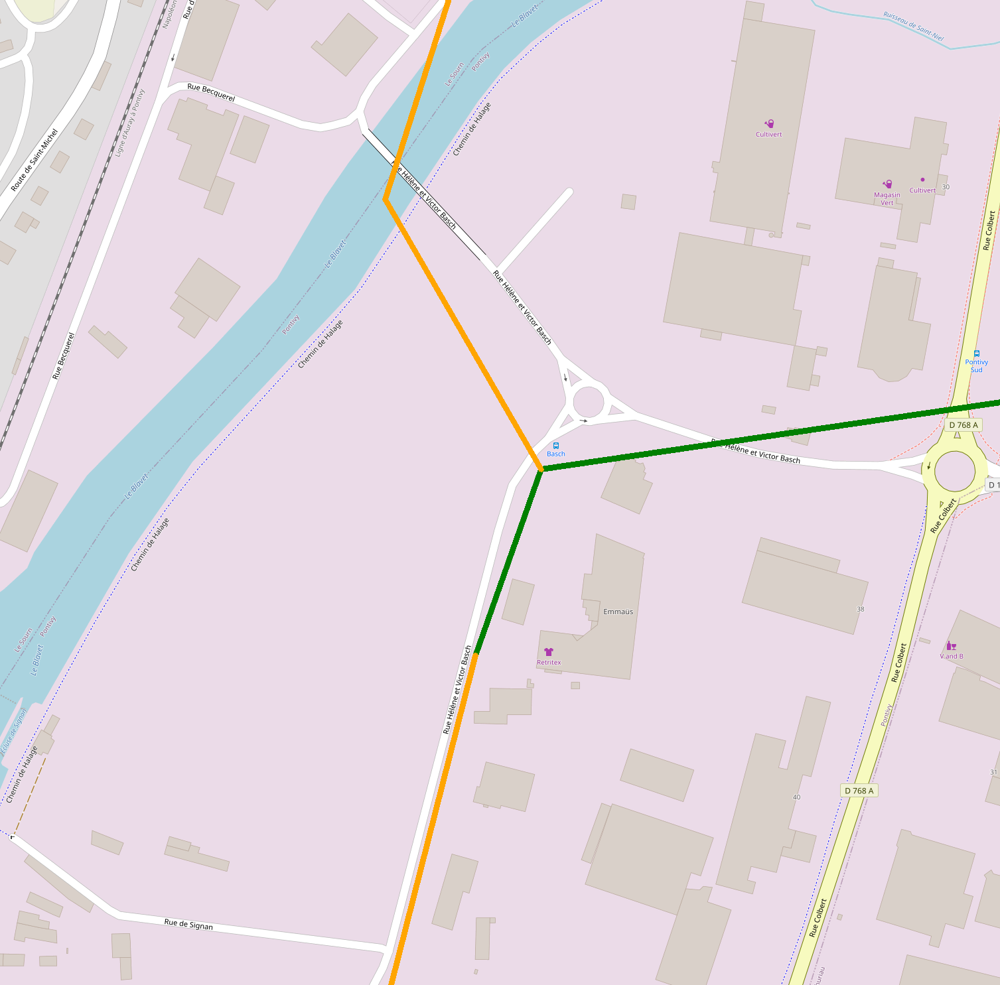
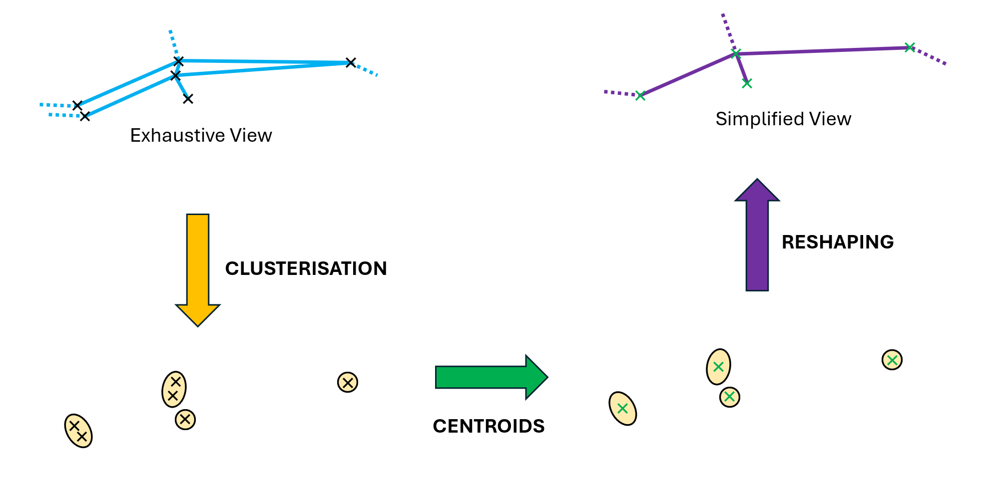

# Simplified Network Calculation

## Introduction

The goal of this feature is to calculate and display a simplified version of the network, either by merging parallel and closely positioned sections or by removing microscopic sections.

Here are some examples of comparisons between the exhaustive view and the simplified view on the same section of network.

  

    
  

  

    
  

  

    
  

  

    
  

## Operation

This process is primarily controlled by a single parameter: `merging_threshold`, which defines the diameter of the clusters.

The simplified network is created through the following three stages:
1. **Cluster formation**: Group nearby points into clusters based on the merging_threshold distance.
2. **Centroid calculation**: Determine the centroids of these clusters.
3. **Network reconstruction**: Rebuild the network by connecting these new centroids.

  

